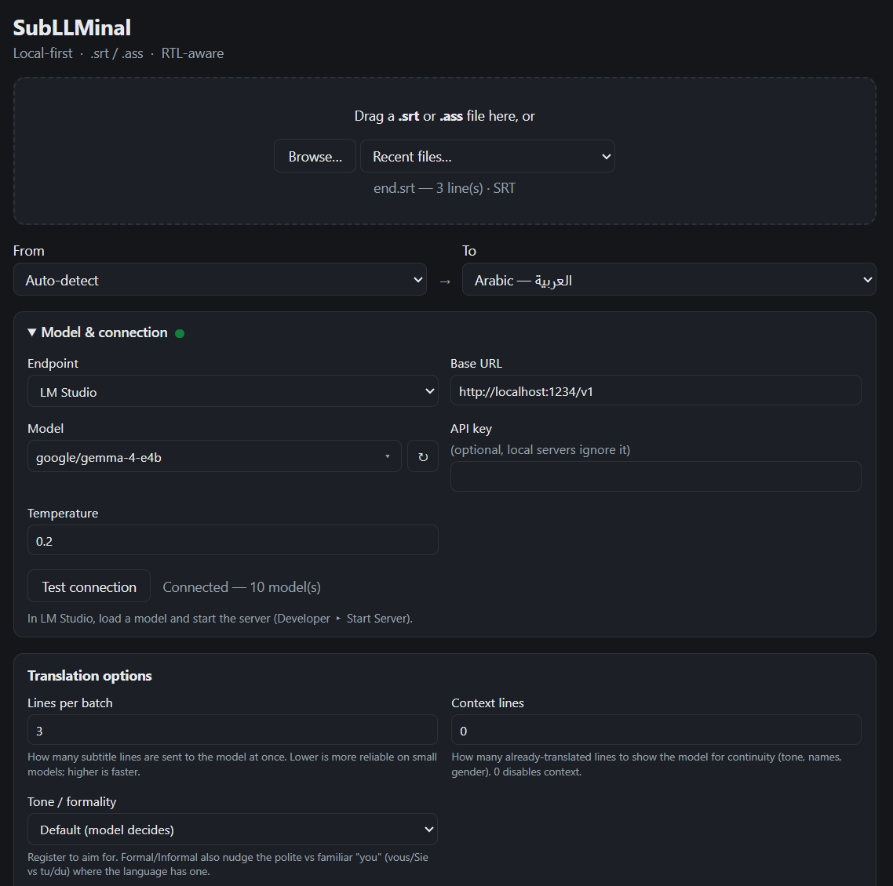
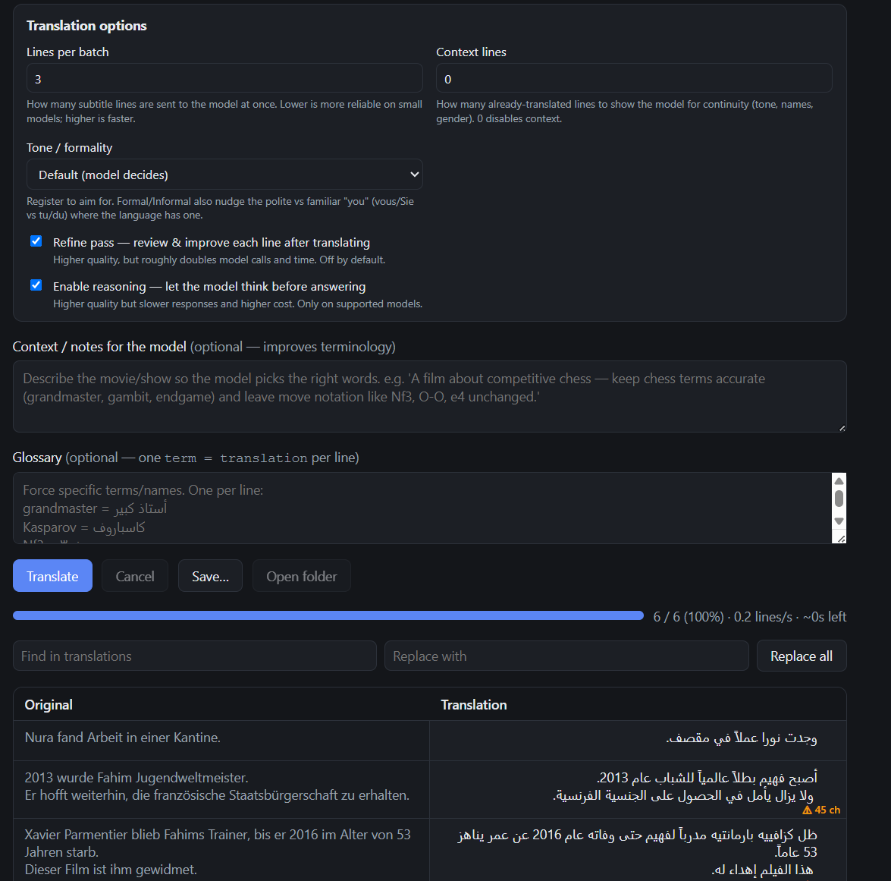
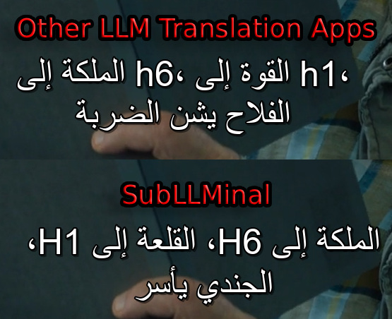

# SubLLMinal

[](https://github.com/LockhartKZ/SubLLMinal/actions/workflows/ci.yml)
[](LICENSE)

A small cross-platform desktop app (**Windows, macOS, Linux**) that translates `.srt`
and `.ass` subtitle files with an LLM — **local-first** (LM Studio, llama.cpp, Ollama)
with optional cloud endpoints. It sends the dialogue a few lines at a time with prior
lines as context, keeps all timing and styling intact, and supports right-to-left
languages (Arabic, Persian, …).

## Screenshots

<table>
  <tr>
    <td width="33%" valign="top" align="center">
      <br>
      <em>Open a subtitle, pick the source/target languages, and connect to a local-first (or cloud) LLM endpoint.</em>
    </td>
    <td width="33%" valign="top" align="center">
      <br>
      <em>Translation options, glossary, and the RTL-aware side-by-side preview — inline editing and reading-speed warnings.</em>
    </td>
    <td width="33%" valign="top" align="center">
      <br>
      <em>RTL done right: Latin runs like <code>H1</code>/<code>H6</code> stay correctly placed inside the right-to-left line — where other apps mis-order them.</em>
    </td>
  </tr>
</table>

## How it works

- The **app** parses the subtitle file. The model only ever receives the spoken
  text — never timestamps or formatting.
- Styling (ASS `{\i1}` tags, `\N` breaks, `<i>` etc.) is hidden behind placeholders,
  so only the words are translated, then the styling is put back.
- Lines are translated in small batches with an id on each line; the app checks the
  model returned every line with its formatting intact, and automatically retries —
  falling back to one-line-at-a-time — so even small local models finish cleanly.
- Input files in any common encoding work — the app **auto-detects the encoding**
  (UTF-8, UTF-8/UTF-16 with BOM, Windows-1256 Arabic, …) and always writes UTF-8.

## Get the app

Grab the build for your OS from the
[**latest release**](https://github.com/LockhartKZ/SubLLMinal/releases/latest). Every
build is **portable — no installer required**. To translate you'll also need an LLM
endpoint (local or cloud); see [For users](#for-users).

### Windows
Download **`SubLLMinal_<version>_x64-portable.exe`** and double-click it — nothing to
install, copy it anywhere. (An installer, `SubLLMinal_<version>_x64-setup.exe`, is also
provided if you'd rather have a Start-menu shortcut.) Needs the Microsoft Edge
**WebView2** runtime, which ships with Windows 11 and recent Windows 10.

### macOS
Download **`SubLLMinal_<version>_universal.zip`** — one build that runs on both Intel
and Apple Silicon. Double-click to unzip, then move **`SubLLMinal.app`** wherever you
like. It uses the system WebKit, so there's nothing else to install.

The app isn't code-signed, so on first launch macOS Gatekeeper blocks it. Clear it
**once**, either way:
- **Right-click** (or Control-click) `SubLLMinal.app` ▸ **Open** ▸ **Open**, or
- run `xattr -dr com.apple.quarantine /path/to/SubLLMinal.app` in Terminal.

After that it opens normally by double-click.

### Linux
Download **`SubLLMinal_<version>_amd64.AppImage`**, make it executable, and run it:
```bash
chmod +x SubLLMinal_*_amd64.AppImage
./SubLLMinal_*_amd64.AppImage
```
The AppImage bundles its own WebKitGTK. On newer distros (e.g. Ubuntu 24.04) you may
need FUSE 2 once: `sudo apt install libfuse2t64` (older distros: `libfuse2`).

## For users

1. **Run a local LLM** (any one of these), or use a cloud endpoint with your own key:
   - **LM Studio** — load a model, then Developer ▸ **Start Server** (`:1234`).
   - **llama.cpp** — run `llama-server` with your GGUF model (`:8080`).
   - **Ollama** — it serves an OpenAI-compatible API at `:11434`.
2. **Open the app**, drag in a `.srt`/`.ass` file (or Browse).
3. Pick the **From** and **To** languages.
4. Open **Model & connection**, choose your endpoint preset, click **Test connection**
   (this also lists the available models), pick a model.
5. Optionally adjust **Translation options** — *Lines per batch* (how many lines go to
   the model at once) and *Context lines* (how many already-translated lines to show it
   for continuity).
6. Optionally fill in **Context / notes for the model** — a short description of the
   movie/show so the model uses the right terminology. e.g. for a chess film: *"keep
   chess terms accurate (grandmaster, gambit) and leave move notation like Nf3, O-O
   unchanged."* This is injected into the prompt for every batch.
7. Click **Translate**, watch the side-by-side preview, then **Save…**.

> A capable, multilingual model gives much better results — especially for Arabic and
> other RTL languages. Bigger/instruction-tuned models follow the formatting rules
> more reliably.

### Handy extras
- **Edit any translation inline** — click a line in the Translation column and type; edits are saved with the file.
- **Retranslate one line** — hover a line and click ↻ to redo just that line.
- **Find & replace** across all translated lines.
- **Recent files** dropdown to reopen quickly.
- **Keyboard shortcuts:** `Ctrl+O` open · `Ctrl+Enter` translate · `Esc` cancel · `Ctrl+S` save.
- **Open folder** after saving reveals the file in your file manager (Explorer/Finder/…).
- The dot next to **Model & connection** turns green when your endpoint is reachable (auto-checked on launch).
- Input subtitles in any common encoding are auto-detected; output is UTF-8.

## For developers

### Prerequisites
- [Node.js](https://nodejs.org/) 18+
- [Rust](https://www.rust-lang.org/tools/install) (rustup) — to build the native shell
- Platform toolchain for the native shell:
  - **Windows** — **MSVC C++ Build Tools** (the “Desktop development with C++” workload
    from the Visual Studio Build Tools; Rust uses its linker) + the WebView2 runtime
    (preinstalled on Windows 11).
  - **macOS** — Xcode Command Line Tools (`xcode-select --install`). Uses the built-in
    WebKit; no runtime to install.
  - **Linux** — `libwebkit2gtk-4.1-dev libappindicator3-dev librsvg2-dev patchelf`
    (build on Ubuntu 22.04 / Debian 12 or newer for WebKitGTK 4.1).

### Commands
```bash
npm install
npx vitest            # unit tests (parsers, engine, client) — no Rust needed
npm run typecheck     # tsc --noEmit
npm run dev           # frontend only, in a browser (Tauri features inert)
npm run tauri dev     # the real desktop app
npm run tauri build   # native bundle under src-tauri/target/release/bundle/
npx vite-node scripts/live-translate.ts   # end-to-end check vs a running local LLM
```

Portable, no-installer builds per OS (the bundler emits these directly):
```bash
# Windows — the self-contained release exe is the portable build:
npm run tauri build                              # then scripts/make-portable.ps1 → portable/
# macOS — one universal .app for Intel + Apple Silicon (zip it for distribution):
npm run tauri build -- --target universal-apple-darwin --bundles app
# Linux — a single self-contained AppImage:
npm run tauri build -- --bundles appimage
```

### Releasing
Pushing a `v*` tag (e.g. `git tag v0.2.0 && git push origin v0.2.0`) runs
[`.github/workflows/release.yml`](.github/workflows/release.yml): it builds all three
OSes and attaches the portable artifacts to a **draft** GitHub Release for review
before you publish. Mac/Linux can't be built from Windows, so CI is the path for them.

### First-time native shell
The `src-tauri/` folder is generated once with `npm run tauri init` (after Rust is
installed), then the HTTP/dialog/store/opener plugins are registered and their
permissions added under `src-tauri/capabilities/`. File read/write is a pair of custom
Rust commands (`read_text_file`/`write_text_file`) rather than the fs plugin, and
`read_text_file` auto-detects the input encoding. The opener plugin is granted only
`reveal-item-in-dir` (the “Open folder” button), nothing broader.

## Project layout
```
src/lib/subtitle/   SRT/ASS parsing + serialization + tag masking
src/lib/llm/        OpenAI-compatible client + endpoint presets
src/lib/translate/  batching/context/alignment engine, prompts, language list
src/lib/io/         native open/save  ·  src/lib/settings.ts  persisted settings
src/main.ts         UI wiring          ·  index.html / src/styles.css  the UI
tests/              Vitest specs + fixtures
```

## Contributing

Changes land via pull requests against `main`. See [CONTRIBUTING.md](CONTRIBUTING.md)
for the workflow and the engine invariants every change must preserve.

## License

[MIT](LICENSE) © LockhartKZ
